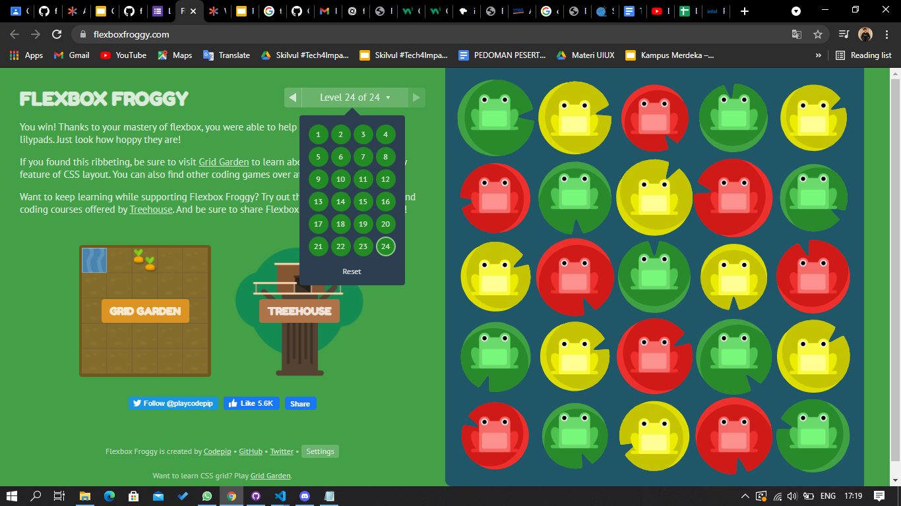

# CSS-Technical Assignment
 

Program ini merupakan program yang dibuat untuk menyelesaikan tugas CSS - Technical Assignment. program ini dubuat menggunakan HTML, dan CSS.

## Tampilan

1. Selector
    >**
2. Box
    >**
3. Display
    >**
4. Flexbox
    >

## Credits

    Author : Fikri Al Ichsan